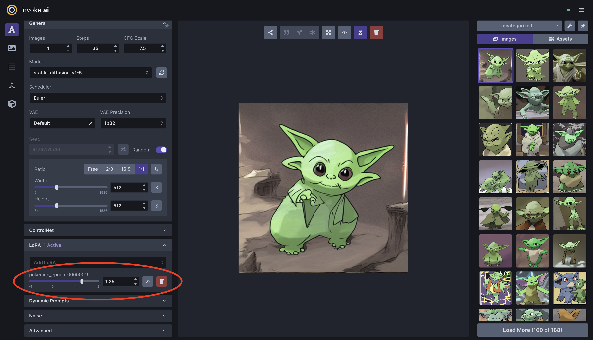

# invoke-training

A library for training custom Stable Diffusion models (fine-tuning, LoRA training, textual inversion, etc.) that can be used in [InvokeAI](https://github.com/invoke-ai/InvokeAI).

**WARNING:**  This repo is currently under construction. More details coming soon.

## Training Modes

- Finetune *(Not implemented yet)*
- Finetune with LoRA
    - Stable Diffusion v1/v2: `invoke-finetune-lora-sd`
    - Stable Diffusion XL: `invoke-finetune-lora-sdxl`
- DreamBooth *(Not implemented yet)*
- DreamBooth with LoRA *(Not implemented yet)*
- Textual Inversion *(Not implemented yet)*
- Pivotal Tuning Inversion *(Not implemented yet)*
- Pivotal Tuning Inversion with LoRA *(Not implemented yet)*

## Developer Quick Start

### Setup Development Environment
1. (Optional) Create a python virtual environment.
1. Install dependencies: `pip install -e .[test]`.
1. (Optional) Install the pre-commit hooks: `pre-commit install`. This will run static analysis tools (black, ruff, isort) on `git commit`.
1. (Optional) Set up `black`, `isort`, and `ruff` in your IDE of choice.

### Unit Tests
Run all unit tests with:
```bash
pytest tests/
```

There are some test 'markers' defined in [pyproject.toml](/pyproject.toml) that can be used to skip some tests. For example, the following command skips tests that require a GPU or require downloading model weights:
```bash
pytest tests/ -m "not cuda and not loads_model"
```

### Finetune a Stable Diffusion model with LoRA
The following steps explain how to train a basic Pokemon Style LoRA using the [lambdalabs/pokemon-blip-captions](https://huggingface.co/datasets/lambdalabs/pokemon-blip-captions) dataset, and how to use it in [InvokeAI](https://github.com/invoke-ai/InvokeAI).

This training process has been tested on an Nvidia GPU with 8GB of VRAM.

1. For this example, we will use the [finetune_lora_sd_pokemon_example.yaml](/configs/finetune_lora_sd_pokemon_example.yaml) config file. See [lora_training_config.py](/src/invoke_training/training/lora/lora_training_config.py) for the full list of supported LoRA training configs.
2. Start training with `invoke-finetune-lora-sd --cfg-file configs/finetune_lora_sd_pokemon_example.yaml`.
3. Monitor the training process with Tensorboard by running `tensorboard --logdir output/` and visiting [localhost:6006](http://localhost:6006) in your browser. Here you can see generated images for fixed prompts throughout the training process.
4. Select a checkpoint based on the quality of the generated images. As an example, we'll use the **Epoch 19** checkpoint.
5. If you haven't already, setup [InvokeAI](https://github.com/invoke-ai/InvokeAI) by following its documentation.
6. Copy your selected LoRA checkpoint into your `${INVOKEAI_ROOT}/autoimport/lora` directory. For example:
```bash
cp output/1691088769.5694647/checkpoint_epoch-00000019.safetensors ${INVOKEAI_ROOT}/autoimport/lora/pokemon_epoch-00000019.safetensors
```
7. You can now use your trained Pokemon LoRA in the InvokeAI UI! 🎉


*Example image generated with the prompt "yoda" and Pokemon LoRA.*
