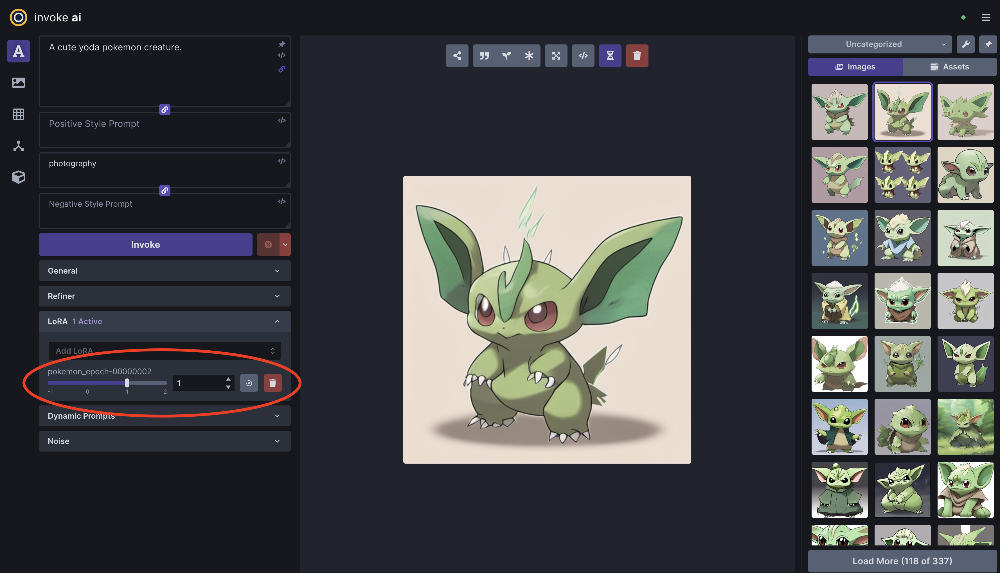

# invoke-training

A library for training custom Stable Diffusion models (fine-tuning, LoRA training, textual inversion, etc.) that can be used in [InvokeAI](https://github.com/invoke-ai/InvokeAI).

**WARNING:**  This repo is currently under construction. More details coming soon.

## Training Modes

There are currently 2 supported training scripts:
- Finetune with LoRA
    - Stable Diffusion v1/v2: `invoke-finetune-lora-sd`
    - Stable Diffusion XL: `invoke-finetune-lora-sdxl`

More training modes will be added soon.

## Developer Quick Start

### Setup Development Environment
1. (Optional) Create a python virtual environment.
1. Install dependencies: `pip install -e .[test]`.
1. (Optional) Install the pre-commit hooks: `pre-commit install`. This will run static analysis tools (black, ruff, isort) on `git commit`.
1. (Optional) Set up `black`, `isort`, and `ruff` in your IDE of choice.

### Unit Tests
Run all unit tests with:
```bash
pytest tests/
```

There are some test 'markers' defined in [pyproject.toml](/pyproject.toml) that can be used to skip some tests. For example, the following command skips tests that require a GPU or require downloading model weights:
```bash
pytest tests/ -m "not cuda and not loads_model"
```

### Finetune a Stable Diffusion model with LoRA
The following steps explain how to train a basic Pokemon Style LoRA using the [lambdalabs/pokemon-blip-captions](https://huggingface.co/datasets/lambdalabs/pokemon-blip-captions) dataset, and how to use it in [InvokeAI](https://github.com/invoke-ai/InvokeAI).

This training process has been tested on an Nvidia GPU with 8GB of VRAM.

1. Select the training configuration file based on your available GPU VRAM and the base model that you want to use:
- [configs/finetune_lora_sd_pokemon_1x8gb_example.yaml](/configs/finetune_lora_sd_pokemon_1x8gb_example.yaml) (SD v1.5, 8GB VRAM)
- [configs/finetune_lora_sdxl_pokemon_1x24gb_example.yaml](/configs/finetune_lora_sdxl_pokemon_1x24gb_example.yaml) (SDXL v1.0, 24GB VRAM)
- [finetune_lora_sdxl_pokemon_1x8gb_example.yaml](/configs/finetune_lora_sdxl_pokemon_1x8gb_example.yaml) (SDXL v1.0, 8GB VRAM, UNet only)
2. Start training with the appropriate command for the config file that you selected:
```bash
# Choose one of the following:
invoke-finetune-lora-sd --cfg-file configs/finetune_lora_sd_pokemon_1x8gb_example.yaml
invoke-finetune-lora-sdxl --cfg-file configs/finetune_lora_sdxl_pokemon_1x24gb_example.yaml
invoke-finetune-lora-sdxl --cfg-file configs/finetune_lora_sdxl_pokemon_1x8gb_example.yaml
```
3. Monitor the training process with Tensorboard by running `tensorboard --logdir output/` and visiting [localhost:6006](http://localhost:6006) in your browser. Here you can see generated images for fixed validation prompts throughout the training process.


*Validation images in the Tensorboard UI.*

4. Select a checkpoint based on the quality of the generated images. In this short training run, there are only 3 checkpoints to choose from. As an example, we'll use the **Epoch 3** checkpoint.
5. If you haven't already, setup [InvokeAI](https://github.com/invoke-ai/InvokeAI) by following its documentation.
6. Copy your selected LoRA checkpoint into your `${INVOKEAI_ROOT}/autoimport/lora` directory. For example:
```bash
# Note: You will have to replace the timestamp in the checkpoint path.
cp output/1691088769.5694647/checkpoint_epoch-00000003.safetensors ${INVOKEAI_ROOT}/autoimport/lora/pokemon_epoch-00000003.safetensors
```
7. You can now use your trained Pokemon LoRA in the InvokeAI UI! 🎉


*Example image generated with the prompt "yoda" and Pokemon LoRA.*

### Custom Datasets

See the [dataset formats](/docs/dataset_formats.md) for a description of the supported dataset formats and instructions for preparing your own custom dataset.
