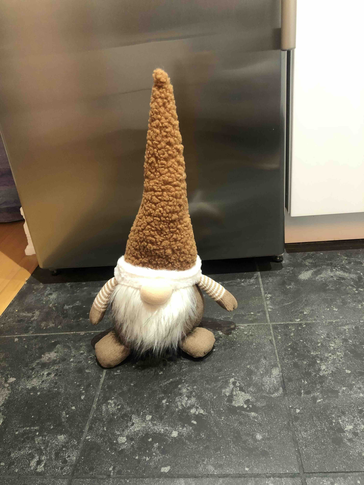
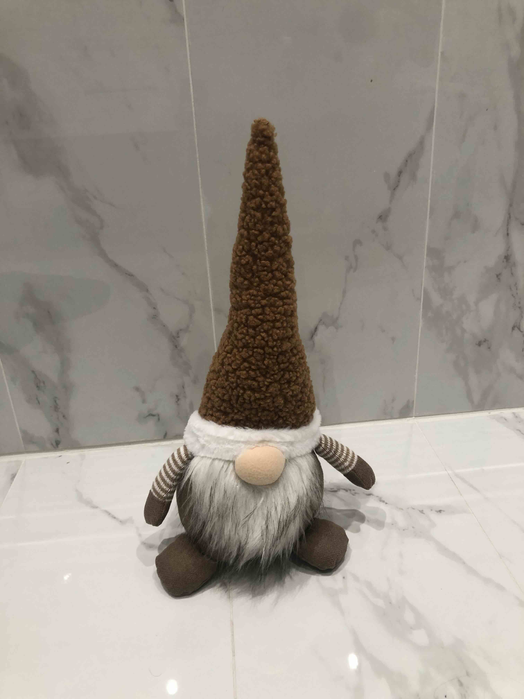
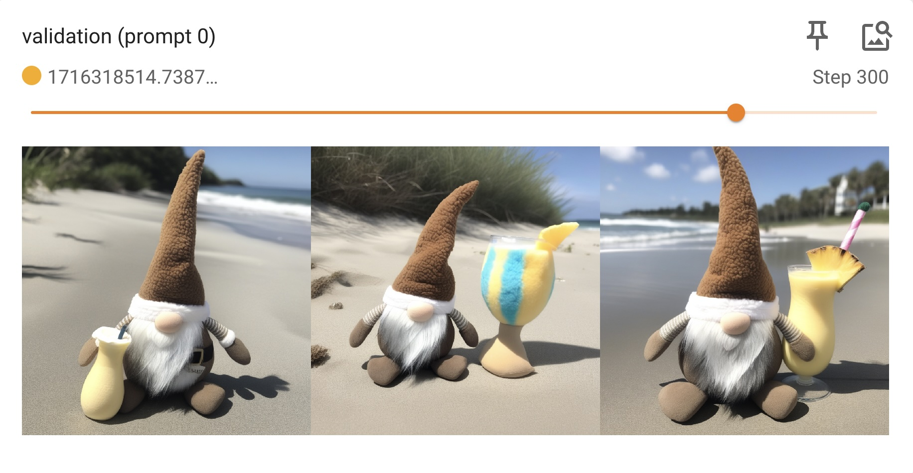

# LoRA with Masks - SDXL

This tutorial explains how to prepare masks for an image dataset and then use that dataset to train an SDXL LoRA model.

Masks can be used to weight regions of images in a dataset to control how much they contribute to the training process. In this tutorial we will use masks to train on a small dataset of images of Bruce the Gnome (4 images). With such a small dataset, there is a high risk of overfitting to the background elements from the images. We will use masks to avoid this problem ond focus only on the object of interest.

## 1 - Dataset Preparation

For this tutorial, we'll use a dataset consisting of 4 images of Bruce the Gnome:

| | |
| - | - |
|  |  |
|  |  |

This sample dataset is included in the invoke-training repo under [sample_data/bruce_the_gnome](https://github.com/invoke-ai/invoke-training/tree/main/sample_data/bruce_the_gnome).

## 2 - Generate Masks

Use the `generate_masks_for_jsonl_dataset.py` script to generate masks for your dataset based on a single prompt. In this case we are using the prompt `"a stuffed gnome"`:
```bash
python src/invoke_training/scripts/_experimental/masks/generate_masks_for_jsonl_dataset.py \
  --in-jsonl sample_data/bruce_the_gnome/data.jsonl \
  --out-jsonl sample_data/bruce_the_gnome/data_masks.jsonl \
  --prompt "a stuffed gnome"
```

The mask generation script will produce the following outputs:

- A directory of generated masks: `sample_data/bruce_the_gnome/masks/`
- A new `.jsonl` file that references the mask images: `sample_data/bruce_the_gnome/data_masks.jsonl`

## 3 - Review the Generated Masks

Review the generated masks to make sure that the target regions were masked. You may need to adjust the prompt and re-generate the masks to achieve the desired result. Alternatively, you can edit the masks manually. The masks are simply single-channel grayscale images (0=background, 255=foreground).

Here are some examples of the masks that we just generated:

| | |
| - | - |
|  |  |
|  |  |

## 4 - Configuration

Below is the training configuration that we'll use for this tutorial.

Raw config file: [src/invoke_training/sample_configs/sdxl_lora_masks_gnome_1x24gb.yaml](https://github.com/invoke-ai/invoke-training/blob/main/src/invoke_training/sample_configs/sdxl_lora_masks_gnome_1x24gb.yaml).


```yaml title="sdxl_lora_masks_gnome_1x24gb.yaml"
--8<-- "src/invoke_training/sample_configs/sdxl_lora_masks_gnome_1x24gb.yaml"
```

Full documentation of all of the configuration options is here: [LoRA SDXL Config](../../reference/config/pipelines/sdxl_lora.md)

There are few things to note about this training config:

- We set `use_masks: True` in order to use the masks that we generated. This configuration is only compatible with datasets that have mask data.
- The `learning_rate`, `max_train_steps`, `save_every_n_steps`, and `validate_every_n_steps` are all _lower_ than typical for an SDXL LoRA training pipeline. The combination of masking with the small dataset size cause training to progress very quickly. These configuration fields were all adjusted accordingly to avoid overfitting.

## 5 - Start Training

Launch the training run.
```bash
# From inside the invoke-training/ source directory:
invoke-train -c src/invoke_training/sample_configs/sdxl_lora_masks_gnome_1x24gb.yaml
```

Training takes ~30 mins on an NVIDIA RTX 4090.

## 4 - Monitor

In a new terminal, launch Tensorboard to monitor the training run:
```bash
tensorboard --logdir output/
```
Access Tensorboard at [localhost:6006](http://localhost:6006) in your browser.

Sample images will be logged to Tensorboard so that you can see how the model is evolving.

Once training is complete, select the model checkpoint that produces the best visual results. For this tutorial, we'll use the checkpoint from step 300:


*Screenshot of the Tensorboard UI showing the validation images for epoch 300. The validation prompt was: "A stuffed gnome at the beach with a pina colada in its hand.".*


## 6 - Import into InvokeAI

If you haven't already, setup [InvokeAI](https://github.com/invoke-ai/InvokeAI) by following its documentation.

Import your trained LoRA model from the 'Models' tab.

Congratulations, you can now use your new Bruce-the-Gnome model! 🎉
