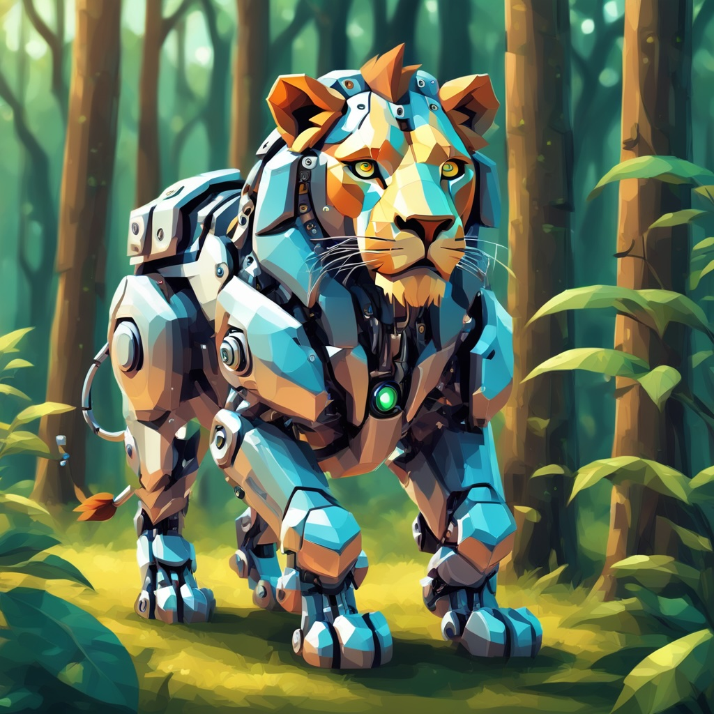
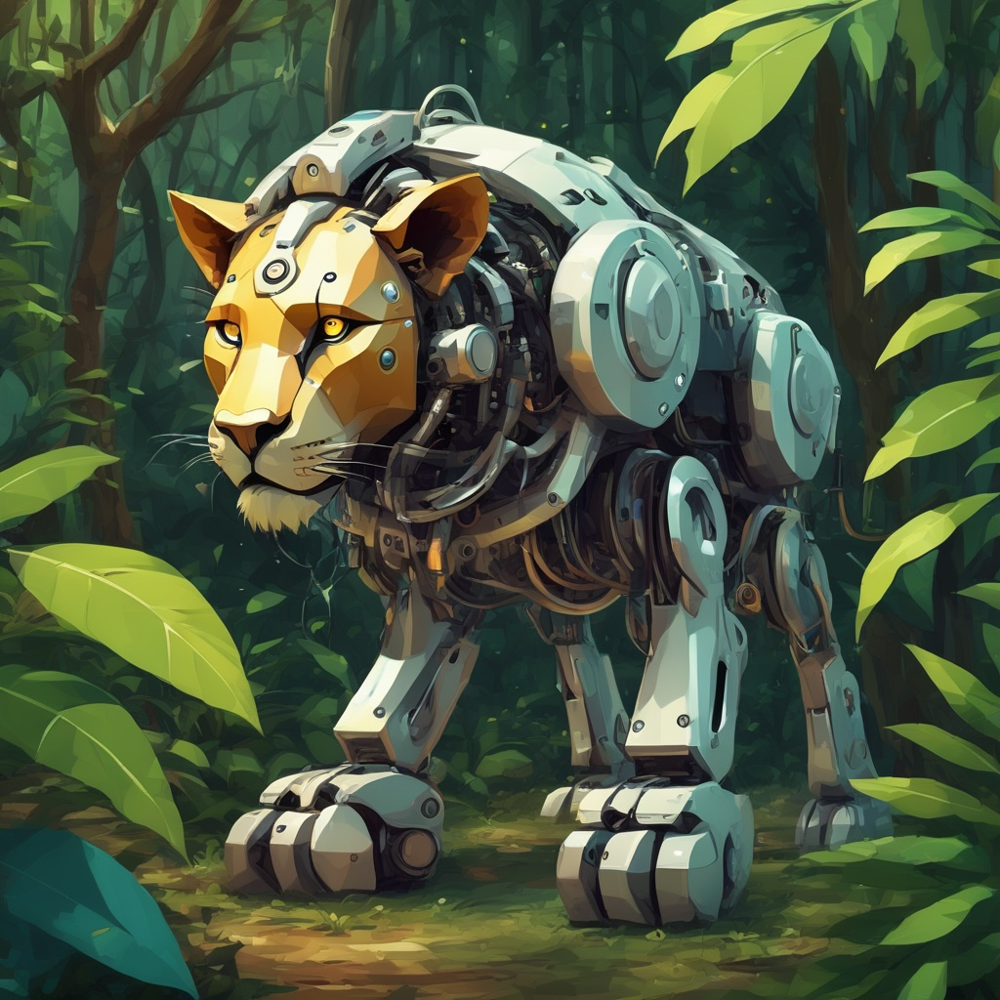

# Finetune - SDXL

This tutorial explains how to do a full finetune training run on a [Stable Diffusion XL](https://huggingface.co/stabilityai/stable-diffusion-xl-base-1.0) base model.

## 0 - Prerequisites

Full model finetuning is more compute-intensive than parameter-efficient finetuning alternatives (e.g. LoRA or Textual Inversion). This tutorial requires a minimum of 24GB of GPU VRAM.

## 1 - Dataset Preparation

For this tutorial, we will use a dataset consisting of 14 images of robocats. The images were auto-captioned. Here are some sample images from the dataset, including their captions:

| | |
| - | - |
|  |  |
| *A white robot with blue eyes and a yellow nose sits on a rock, gazing at the camera, with a pink tree and a white cat in the background.* | *A white cat with green eyes and a blue collar sits on a moss-covered rock in a forest, gazing directly at the camera.* |

## 2 - Configuration

Below is the training configuration that we'll use for this tutorial.

Raw config file: [src/invoke_training/sample_configs/sdxl_finetune_robocats_1x24gb.yaml](https://github.com/invoke-ai/invoke-training/blob/main/src/invoke_training/sample_configs/sdxl_finetune_robocats_1x24gb.yaml).


```yaml title="sdxl_finetune_robocats_1x24gb.yaml"
--8<-- "src/invoke_training/sample_configs/sdxl_finetune_robocats_1x24gb.yaml"
```

Full documentation of all of the configuration options is here: [Finetune SDXL Config](../../reference/config/pipelines/sdxl_finetune.md)

!!! note "`save_checkpoint_format`"
    Note the `save_checkpoint_format` setting, as it is unique to full finetune training. For this tutorial, we have set `save_checkpoint_format: trained_only_diffusers`. This means that only the UNet model will be saved at each checkpoint, and it will be saved in diffusers format. This setting conserves disk space by not redundantly saving the non-trained weights. Before these UNet checkpoints can be used, they must either be merged into a full model, or extracted into a LoRA. Instructions for this follow later in this tutorial. A full explanation of the `save_checkpoint_format` options can be found here:  [save_checkpoint_format][invoke_training.pipelines.stable_diffusion_xl.finetune.config.SdxlFinetuneConfig.save_checkpoint_format].


## 3 - Start Training

Launch the training run.
```bash
# From inside the invoke-training/ source directory:
invoke-train -c src/invoke_training/sample_configs/sdxl_finetune_robocats_1x24gb.yaml
```

Training takes ~45 mins on an NVIDIA RTX 4090.

## 4 - Monitor

In a new terminal, launch Tensorboard to monitor the training run:
```bash
tensorboard --logdir output/
```
Access Tensorboard at [localhost:6006](http://localhost:6006) in your browser.

Sample images will be logged to Tensorboard so that you can see how the model is evolving.

Once training is complete, select the model checkpoint that produces the best visual results.

## 5 - Prepare the trained model

Since we set `save_checkpoint_format: trained_only_diffusers`, our selected checkpoint only contains the UNet model weights. The checkpoint has the following directory structure:

```bash
output/robocats/sdxl_finetune/1715373799.3558652/checkpoints/checkpoint-epoch_00000500-step_00002000/
└── unet
    ├── config.json
    └── diffusion_pytorch_model.safetensors
```

Before we can use this trained model, we must do one of the following:

- Prepare a full diffusers checkpoint with the new UNet weights.
- Extract the difference between the trained UNet and the original UNet into a LoRA model.

### Prepare a full model

If we want to use our finetuned UNet model, we must first package it into a format supported by applications like InvokeAI.

In this section we will assume that we have a full SDXL base model in diffusers format. It should have a directory structure like the one shown before. We simply need to replace the `unet/` directory with the one from our selected training checkpoint:
```bash
stable-diffusion-xl-base-1.0
├── model_index.json
├── scheduler
│   └── scheduler_config.json
├── text_encoder
│   ├── config.json
│   └── model.fp16.safetensors
├── text_encoder_2
│   ├── config.json
│   └── model.fp16.safetensors
├── tokenizer
│   ├── merges.txt
│   ├── special_tokens_map.json
│   ├── tokenizer_config.json
│   └── vocab.json
├── tokenizer_2
│   ├── merges.txt
│   ├── special_tokens_map.json
│   ├── tokenizer_config.json
│   └── vocab.json
├── unet # <-- Replace this directory with the trained checkpoint.
│   ├── config.json
│   └── diffusion_pytorch_model.fp16.safetensors
├── vae
│   ├── config.json
│   └── diffusion_pytorch_model.fp16.safetensors
└── vae_1_0
    └── diffusion_pytorch_model.fp16.safetensors
```

!!! note "diffusers variants (e.g. 'fp16')"
    In this example, notice that the `*.safetensors` files contain `.fp16.` in their filenames. Hugging Face refers to this identifier as a "variant". It is used to select between multiple model variants in their model hub.
    In this case, we should add the `.fp16.` variant tag to our finetuned UNet for consistency with the rest of the model. Since we set `save_dtype: float16` in our training config, the `fp16` tag accurately represents the precision of our UNet model file.

### Extract a LoRA model

An alternative to using the finetuned UNet model directly is to compare it against the original and extract the difference as a LoRA model. The resultant LoRA has a much smaller file size and can be applied to any base model. But, the LoRA model is a *lossy* representation of the difference, so some quality degradation is expected.

To extract a LoRA model, run the following command:
```bash
python src/invoke_training/scripts/_experimental/lora_extraction/extract_lora_from_checkpoint.py \
  --model-type sdxl \
  --model-orig path/to/stable-diffusion-xl-base-1.0/unet \
  --model-tuned output/robocats/sdxl_finetune/1715373799.3558652/checkpoints/checkpoint-epoch_00000500-step_00002000/unet \
  --save-to robocats_lora_step_2000.safetensors \
  --lora-rank 32
```

## 6 - Import into InvokeAI

If you haven't already, setup [InvokeAI](https://github.com/invoke-ai/InvokeAI) by following its documentation.

Import your finetuned diffusers model or your extracted LoRA from the 'Models' tab.

Congratulations, you can now use your new robocat model! 🎉

## 7 - Comparison: Finetune vs. LoRA Extraction

As noted earlier, the LoRA extraction process is lossy for a number of reasons. (There are some significant improvements coming to the LoRA extraction process soon to improve the fidelity of the extracted LoRA model.)

Below, we compare images generated with the same seed and prompt for 3 different model configurations.

Prompt: *In robocat style, a robotic lion in the jungle.*

| SDXL Base 1.0 | w/ Finetuned UNet | w/ Extracted LoRA |
| - | - | - |
|  |  | 
